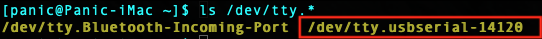
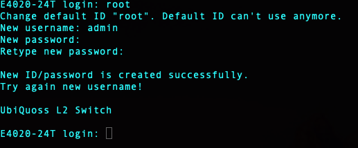
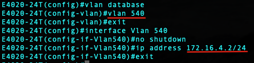
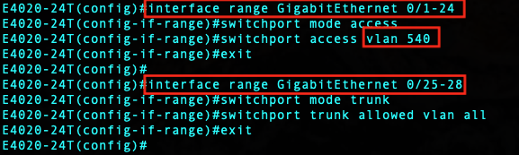
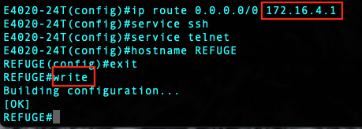
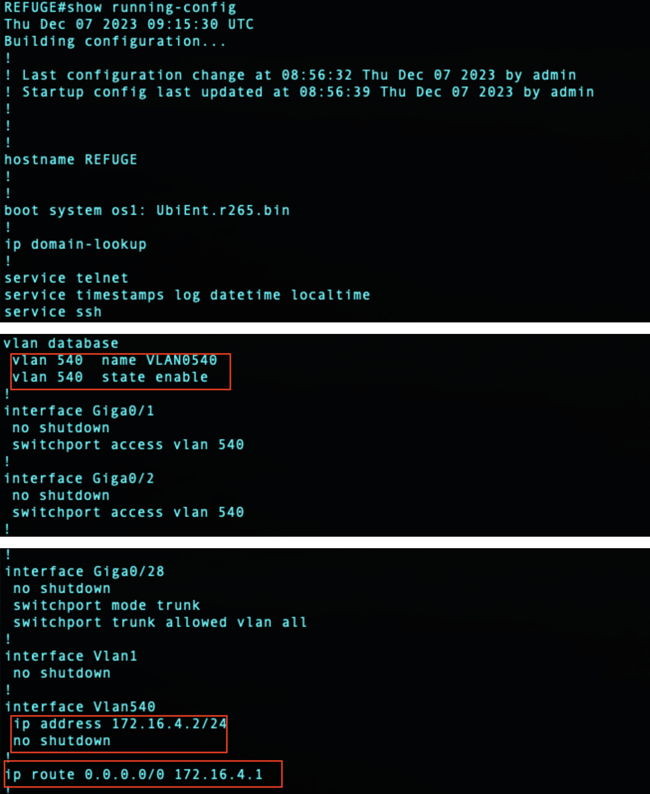
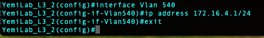

# Setting E4020-24T
* 설정의 예 : `VLAN 540 / 172.16.4.X`

### Contents
1. [콘솔 접속](#connect-console)
2. [첫 시작시 설정](#first-setting)
3. [설정모드 진입](#configure-mode)
4. [VLAN 생성 및 설정](#vlan-setting)
5. [Port 설정](#port-setting)
6. [기타 설정](#ETC-setting)
7. [설정 확인](#confirmation)
8. [L3 스위치 설정](#L3-setting)

## Connect console
* 접속할 포트 찾기 : `ls /dev/tty.*`
</img>

* 콘솔에 연결하기 (Speed : 9600)
	* `screen /dev/tty.usbserial-14120 9600`
</img>

## First Setting
* 최초 시작시 : `root` 로 로그인
*  새로운 계정 생성 :  `admin / Innost7242!@`
</img>
	* c.f.) E5010 : `admin / admin123!`

## Configure Mode
* 관리자모드 변경 : `en`
	* > &rarr; # 
* 설정모드 진입 : `configure terminal`

</img>

* 비밀번호 변경 : `username admin password [변경]`

## VLAN Setting
* VLAN 설정모드 진입 : `vlan database`
* VLAN 생성 : `vlan [VLAN]`
* 생성된 VLAN 진입 : `interface Vlan [VLAN]`
* VLAN Option : `no shutdown`
* IP Address 부여 : `ip address X.X.X.X/m`
	* 예미랩 지하 : `172.16.X.2/24`

</img>

## Port Setting
* E4020 장비는 24개의 UDP 포트와 4개의 Optical 포트로 구성되어 있다
1. 1-24 포트 설정
	* 설정모드 진입 : `interface range GigabitEthernet 0/1-24`
	* Setup :
		* `switchport mode access`
		* `switchport access vlan [VLAN]`
2. 25-28 포트 설정
	* 설정모드 진입 : `interface range GigabitEthernet 0/25-28`
	* Setup :
		* `switchport mode trunk`
		* `switchport trunk allowed vlan all`

</img>

## ETC Setting
* Gateway 설정 : `ip route 0.0.0.0/0 XX.XX.XX.1`
	* 예미랩 지하 : `172.16.X.1`
* 원격접속 설정 :
	* `service ssh`
	* `service telnet`
* 호스트네임 변경 : `hostname [HOSTNAME]`
* 저장 : `write`

</img>

## Confirmation
* `show running-config`

</img>

## L3 Setting
* L3 스위치 접속 : `172.16.0.1`
	*  ID / PW : `root / innost7242!@`
*  Configure Mode 진입 : `en` &rarr; `configure terminal`
*  VLAN 진입 : `interface Vlan [VLAN]`
*  연결된 VLAN에 IP 부여 : `ip address 172.168.x.1/24`

</img>

